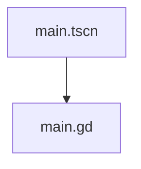

# 场景结构说明

## 概述

当前项目只有一个场景文件 [main.tscn](file:///F:/帝国：博弈/main.tscn)，该场景是项目的主入口场景，实现了一个基于《帝国：博弈》维多利亚时代国家领导人卡牌游戏设计文档的动态卡牌游戏界面。

## 场景详情

### 主场景 (main.tscn)

- **文件路径**: `res://main.tscn`
- **场景UID**: uid://cxb0omrt2dqwf
- **场景类型**: Node2D

#### 节点结构

```
Main (Node2D)
├── Background (ColorRect)
├── GameTitle (Label)
├── CardScrollContainer (ScrollContainer)
│   └── CardContainer (HBoxContainer)
└── CardInfo (Label)
```

#### 资源依赖

- **外部资源**:
  - 脚本文件: [main.gd](file:///F:/帝国：博弈/main.gd) (uid://cdsnpjbuhlxwa)
  - 卡牌数据文件: [Data/cards.json](file:///F:/帝国：博弈/Data/cards.json)

#### 脚本关联

- **关联脚本**: [main.gd](file:///F:/帝国：博弈/main.gd)
- **脚本类型**: GDScript
- **脚本继承**: Node2D

#### 脚本内容分析

当前脚本实现动态卡牌生成和交互系统:

```gdscript
extends Node2D

# 卡牌数据
var card_data = []
var card_nodes = []

# 节点引用
@onready var card_container = $CardScrollContainer/CardContainer
@onready var card_info_label = $CardInfo

# Called when the node enters the scene tree for the first time.
func _ready():
    print("帝国：博弈 - 卡牌游戏界面已加载")
    
    # 加载卡牌数据
    load_card_data()
    
    # 创建所有领袖卡
    create_leader_cards()

# 加载卡牌数据
func load_card_data():
    var file = FileAccess.open("res://Data/cards.json", FileAccess.READ)
    if file:
        var json_text = file.get_as_text()
        file.close()
        
        var json = JSON.new()
        var parse_result = json.parse(json_text)
        
        if parse_result == OK:
            card_data = json.data
            print("成功加载卡牌数据，共找到 ", card_data.size(), " 张卡牌")
        else:
            print("解析JSON失败: ", json.get_error_message())
    else:
        print("无法打开卡牌数据文件")

# 创建所有领袖卡
func create_leader_cards():
    # 清除现有卡牌
    for child in card_container.get_children():
        child.queue_free()
    
    card_nodes.clear()
    
    # 为每张领袖卡创建UI
    for current_card_info in card_data:
        var card_node = create_card_ui(current_card_info)
        if card_node:
            card_container.add_child(card_node)
            card_nodes.append(card_node)

# 创建单个卡牌UI
func create_card_ui(card_info):
    # 创建卡牌面板
    var card_panel = Panel.new()
    card_panel.custom_minimum_size = Vector2(200, 300)
    card_panel.size_flags_horizontal = Control.SIZE_SHRINK_BEGIN
    card_panel.size_flags_vertical = Control.SIZE_SHRINK_BEGIN
    
    # 创建卡牌内容标签
    var card_label = Label.new()
    card_label.name = "CardLabel"
    card_label.set_anchors_and_offsets_preset(Control.PRESET_FULL_RECT)
    card_label.anchors_preset = Control.PRESET_FULL_RECT
    card_label.offset_left = 10
    card_label.offset_top = 10
    card_label.offset_right = -10
    card_label.offset_bottom = -10
    card_label.grow_horizontal = Control.GROW_DIRECTION_BOTH
    card_label.grow_vertical = Control.GROW_DIRECTION_BOTH
    
    # 构建卡牌文本
    var card_text = card_info.cardName + "\n"
    card_text += "影响力: " + str(card_info.influence) + "\n"
    card_text += "时代: " + str(card_info.era) + "\n\n"
    
    if card_info.skills and card_info.skills.size() > 0:
        card_text += "技能: " + card_info.skills[0].name + "\n"
        card_text += card_info.skills[0].description
    
    card_label.text = card_text
    card_label.horizontal_alignment = HORIZONTAL_ALIGNMENT_CENTER
    card_label.vertical_alignment = VERTICAL_ALIGNMENT_CENTER
    card_label.autowrap_mode = TextServer.AUTOWRAP_WORD_SMART
    card_label.add_theme_font_size_override("font_size", 14)
    
    # 添加到卡牌面板
    card_panel.add_child(card_label)
    
    # 添加交互
    card_panel.gui_input.connect(_on_card_gui_input.bind(card_info))
    card_panel.mouse_filter = Control.MOUSE_FILTER_STOP
    
    # 添加悬停效果
    card_panel.mouse_entered.connect(_on_card_mouse_entered.bind(card_info))
    card_panel.mouse_exited.connect(_on_card_mouse_exited.bind(card_info))
    
    return card_panel

# 卡牌交互处理函数
func _on_card_gui_input(event, card_info):
    if event is InputEventMouseButton and event.pressed and event.button_index == MOUSE_BUTTON_LEFT:
        print("选择了卡牌: ", card_info.cardName)
        update_card_info(card_info)

# 鼠标悬停效果
func _on_card_mouse_entered(card_info):
    update_card_info(card_info)

func _on_card_mouse_exited(card_info):
    card_info_label.text = "点击卡牌查看详细信息"

# 更新卡牌信息显示
func update_card_info(card_info):
    var info_text = "【" + card_info.cardName + "】\n"
    info_text += "影响力: " + str(card_info.influence) + "  |  时代: " + str(card_info.era) + "\n"
    
    if card_info.skills and card_info.skills.size() > 0:
        info_text += "技能: " + card_info.skills[0].name + "\n"
        info_text += card_info.skills[0].description
    
    card_info_label.text = info_text
```

## 依赖关系图



## 功能描述

该场景实现了一个基于《帝国：博弈》设计文档的动态卡牌游戏界面，包含以下功能：

1. **动态卡牌生成**：从JSON数据文件加载所有领袖卡牌数据
2. **卡牌展示**：动态创建和显示所有领袖卡牌
3. **交互功能**：为每张卡牌添加点击和悬停事件处理
4. **详细信息显示**：在底部信息面板显示选中卡牌的详细信息
5. **滚动容器**：支持多张卡牌的横向滚动浏览

## 使用说明

1. **卡牌数据加载**：自动从 `Data/cards.json` 加载所有领袖卡牌数据
2. **卡牌交互**：
   - 鼠标悬停卡牌：在底部信息面板显示卡牌详细信息
   - 点击卡牌：在控制台输出选择信息并更新信息面板
3. **界面导航**：使用滚动容器浏览所有卡牌
4. **扩展性**：基于JSON数据格式，可轻松添加新的领袖卡牌

## 技术实现

1. **数据驱动**：使用JSON文件存储卡牌数据，实现数据与逻辑的分离
2. **动态UI生成**：运行时根据数据动态创建卡牌界面元素
3. **事件系统**：使用Godot的信号系统处理用户交互
4. **响应式布局**：使用Control节点和布局预设确保UI适配性

## 建议

1. **卡牌美术资源**：为卡牌添加背景图片、领袖头像等视觉元素
2. **动画效果**：实现卡牌翻转、悬停放大、选中高亮等动画效果
3. **音效系统**：为卡牌交互添加音效反馈，如点击声、悬停提示音
4. **状态管理**：实现卡牌的状态变化（如选中、禁用、激活等）
5. **游戏逻辑**：基于卡牌数据实现具体的游戏机制和规则
6. **数据验证**：添加卡牌数据的验证逻辑，确保数据完整性
7. **性能优化**：对大量卡牌的加载和渲染进行性能优化
8. **本地化支持**：为卡牌文本添加多语言支持

## 数据结构

### 卡牌JSON数据格式

```json
{
  "cardName": "领袖姓名",
  "cardType": "Leader",
  "influence": 影响力数值,
  "era": 时代数值,
  "skills": [
    {
      "name": "技能名称",
      "description": "技能描述",
      "cost": 技能消耗,
      "effect": 技能效果
    }
  ]
}
```

### 场景节点引用

- `card_container`: 卡牌容器节点，用于存放所有卡牌面板
- `card_info_label`: 底部信息标签，用于显示选中卡牌的详细信息