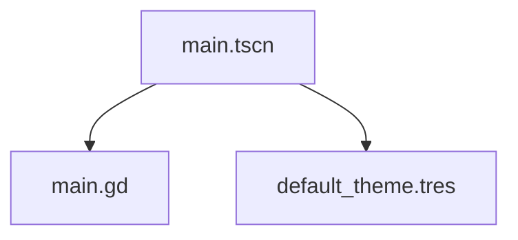

# 场景结构说明

## 概述

当前项目只有一个场景文件 [main.tscn](file:///F:/帝国：博弈/main.tscn)，该场景是项目的主入口场景，实现了一个基础的卡牌游戏界面。

## 场景详情

### 主场景 (main.tscn)

- **文件路径**: `res://main.tscn`
- **场景UID**: uid://cxb0omrt2dqwf
- **场景类型**: Node2D

#### 节点结构

```
Main (Node2D)
├── Background (ColorRect)
├── GameTitle (Label)
├── CardContainer (HBoxContainer)
│   ├── Card1 (Panel)
│   │   └── Card1Label (Label)
│   ├── Card2 (Panel)
│   │   └── Card2Label (Label)
│   └── Card3 (Panel)
│       └── Card3Label (Label)
```

#### 资源依赖

- **外部资源**:
  - 脚本文件: [main.gd](file:///F:/帝国：博弈/main.gd) (uid://cdsnpjbuhlxwa)
  - 主题资源: default_theme.tres (uid://bq0qd65osa6xf)

#### 脚本关联

- **关联脚本**: [main.gd](file:///F:/帝国：博弈/main.gd)
- **脚本类型**: GDScript
- **脚本继承**: Node2D

#### 脚本内容分析

当前脚本实现基础的卡牌游戏逻辑:

```gdscript
extends Node2D

# Called when the node enters the scene tree for the first time.
func _ready():
    print("帝国：博弈 - 卡牌游戏界面已加载")
    
    # 连接卡牌的点击信号（如果需要交互）
    var card1 = $CardContainer/Card1
    var card2 = $CardContainer/Card2
    var card3 = $CardContainer/Card3
    
    # 为卡牌添加简单的交互效果
    card1.gui_input.connect(_on_card_gui_input.bind("维多利亚女王"))
    card2.gui_input.connect(_on_card_gui_input.bind("俾斯麦"))
    card3.gui_input.connect(_on_card_gui_input.bind("谷物法废除"))

# Called every frame. 'delta' is the elapsed time since the previous frame.
func _process(delta):
    pass

# 卡牌交互处理函数
func _on_card_gui_input(event, card_name):
    if event is InputEventMouseButton and event.pressed and event.button_index == MOUSE_BUTTON_LEFT:
        print("选择了卡牌: ", card_name)
        # 在这里可以添加卡牌使用逻辑
```

## 依赖关系图



## 场景功能说明

### 界面元素

1. **背景**: 使用深蓝色纯色背景(ColorRect)
2. **标题**: 显示"帝国：博弈"的游戏标题
3. **卡牌容器**: 使用水平布局容器(HBoxContainer)排列卡牌
4. **卡牌**: 三张示例卡牌，展示不同类型的卡牌：
   - 维多利亚女王(领袖卡)
   - 俾斯麦(领袖卡)
   - 谷物法废除(政策卡)

### 交互功能

当前场景实现了基础的卡牌交互功能：
- 每张卡牌可以接收鼠标点击事件
- 点击卡牌时会在控制台输出相关信息

## 建议

1. **视觉改进**：
   - 根据《帝国：博弈》维多利亚时代国家领导人卡牌游戏设计文档中的视觉规范手册，改进卡牌的视觉设计
   - 添加符合维多利亚时代风格的UI元素和装饰

2. **功能扩展**：
   - 实现完整的卡牌使用逻辑
   - 添加动画效果增强用户体验
   - 扩展卡牌类型和更多游戏机制