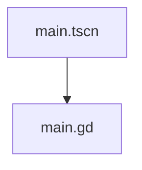

# 场景结构说明

## 概述

当前项目只有一个场景文件 [main.tscn](file:///F:/帝国：博弈/main.tscn)，该场景是项目的主入口场景。

## 场景详情

### 主场景 (main.tscn)

- **文件路径**: `res://main.tscn`
- **场景UID**: uid://cxb0omrt2dqwf
- **场景类型**: Node2D

#### 节点结构

```
Main (Node2D)
```

#### 资源依赖

- **外部资源**:
  - 脚本文件: [main.gd](file:///F:/帝国：博弈/main.gd) (uid://cdsnpjbuhlxwa)

#### 脚本关联

- **关联脚本**: [main.gd](file:///F:/帝国：博弈/main.gd)
- **脚本类型**: GDScript
- **脚本继承**: Node

#### 脚本内容分析

当前脚本内容非常简单，仅包含类的继承声明:

```gdscript
extends Node
```

## 依赖关系图


