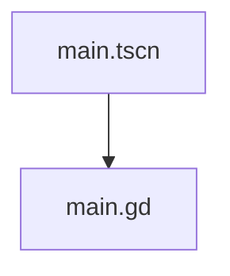

# 场景结构说明

## 概述

当前项目只有一个场景文件 [main.tscn](file:///F:/帝国：博弈/main.tscn)，该场景是项目的主入口场景。现已重构为新的界面布局：右上角显示主牌堆、事件牌堆与弃牌堆；标题移动到顶端；左侧与右侧显示领袖名称的彩色矩形（白色边框），标题右侧与牌堆左侧之间设置四个事件槽。

### 本次更新（UI 调整）
- 删除底部提示文本“点击卡牌查看详细信息”（CardInfo 默认文本置空；鼠标移出不再恢复该提示）。
- 事件槽从右侧纵向改为顶端横向排列，统一尺寸 120×150（4:5）。
- 三类牌堆面板（牌堆/事件牌堆/弃牌堆）同步缩小为 120×150，与事件槽保持一致尺寸与比例。
- 领袖名称彩色矩形：颜色从十六进制字符串（如 `#C8102E`）解析并正确显示；左/右列垂直间距加大、上方两名整体下移并加大水平距离；矩形内居中显示领袖名称。

## 场景详情

### 主场景 (main.tscn)

- **文件路径**: `res://main.tscn`
- **场景UID**: uid://cxb0omrt2dqwf
- **场景类型**: Node2D

#### 节点结构

```
Main (Node2D)
├── Background (ColorRect)
├── GameTitle (Label)
├── CardScrollContainer (ScrollContainer) [隐藏]
│   └── CardContainer (HBoxContainer)
├── DeckPanel (Panel)
│   └── DeckLabel (Label)
├── EventDeckPanel (Panel)
│   └── EventDeckLabel (Label)
├── DiscardPilePanel (Panel)
│   └── DiscardLabel (Label)
├── EventSlots (Node)
│   ├── EventSlotPanel1 (Panel)
│   ├── EventSlotPanel2 (Panel)
│   ├── EventSlotPanel3 (Panel)
│   └── EventSlotPanel4 (Panel)
└── LeaderNameContainer (Control)
└── CardInfo (Label)
```

#### 资源依赖

- **外部资源**:
  - 脚本文件: [main.gd](file:///F:/帝国：博弈/main.gd) (uid://cdsnpjbuhlxwa)
  - 卡牌数据文件: [Data/cards.json](file:///F:/帝国：博弈/Data/cards.json)
  - 数据文件: [Data/default.json](file:///F:/帝国：博弈/Data/default.json)、[Data/policies.json](file:///F:/帝国：博弈/Data/policies.json)、[Data/events.json](file:///F:/帝国：博弈/Data/events.json)
  - 字体资源: [fonts.ttf](file:///F:/帝国：博弈/fonts.ttf)
  - 样式资源: [card_style.tres](file:///F:/帝国：博弈/card_style.tres)（StyleBoxFlat，用作面板样式）
  - 面板尺寸策略：统一采用 4:5 比例，当前为 120×150。
  - 外部资源ID规范：`ExtResource` 已统一为数值ID（脚本=1、字体=2、样式=3），对应引用分别为 `ExtResource("1")`、`ExtResource("2")`、`ExtResource("3")`。

#### 子资源与事件槽样式修复

- 事件槽面板统一使用场景内定义的 `StyleBoxFlat` 子资源；子资源声明已上移至文件头部的资源区域（紧随 `ExtResource` 之后）。
- 为避免“Invalid parameter”解析错误，子资源ID统一为数值：`id=1`。
- 四个事件槽面板的样式引用统一为：`theme_override_styles/panel = SubResource("1")`。
- 所有场景注释采用 `;`，避免使用 `#` 导致解析错误。
 - 事件槽位置更新：顶端横向排列，尺寸统一为 120×150。
  - 事件槽具体位置：`EventSlotPanel1~4` 依次位于 `(1100,80)-(1220,230)`, `(1250,80)-(1370,230)`, `(1400,80)-(1520,230)`, `(1550,80)-(1670,230)`；左右边距与间距保持一致（手动设定，不使用代码计算）。

#### 脚本关联

- **关联脚本**: [main.gd](file:///F:/帝国：博弈/main.gd)
- **脚本类型**: GDScript
- **脚本继承**: Node2D
 - **脚本格式修复**: 统一缩进为制表符（Tab），修复 Godot 解析错误“Used space character for indentation instead of tab as used before in the file”（定位于 246、264~291 行）。
- **领袖名布局**: `create_leader_name_panels()` 固定坐标数组（左4：`(40,520/610/700/790)`；上2：`(500,80/1040,80)`；右4：`(1540,520/610/700/790)`），统一尺寸 `140×40`，不使用公式计算；当名称为“阿卜杜勒-迈吉德一世”时字号为 `14`（其余为 `16`），确保文字完全容纳。
 - **领袖名布局**: `create_leader_name_panels()` 固定坐标数组更新：
   - 顶部两张整体左移，坐标改为 `(410,80)` 与 `(950,80)`，避免与事件槽重叠。
   - 右列四张 `x=1540`，竖直间距 `x=200`，坐标为 `y=310/510/710/910`，首张位于事件槽下方且与其下边缘间距约 `80>0.35x`，末张到底边间距约 `130`，不比 `x` 大太多。
   - 左列四张 `x=40`，分别与右列 `y` 对齐：`310/510/710/910`。
   - 统一尺寸 `140×40`，不使用公式计算；名称为“阿卜杜勒-迈吉德一世”字号为 `14`（其余为 `16`），确保文字完全容纳。

#### 脚本内容分析

当前脚本实现新的界面逻辑与数据系统:

```gdscript
extends Node2D

# 卡牌数据
var card_data = []
var card_nodes = []

# 节点引用
@onready var card_container = $CardScrollContainer/CardContainer
@onready var card_info_label = $CardInfo
@onready var deck_panel = $DeckPanel
@onready var event_deck_panel = $EventDeckPanel
@onready var discard_panel = $DiscardPilePanel
@onready var deck_label: Label = $DeckPanel/DeckLabel
@onready var event_deck_label: Label = $EventDeckPanel/EventDeckLabel
@onready var discard_label: Label = $DiscardPilePanel/DiscardLabel
@onready var leader_name_container: Control = $LeaderNameContainer

# Called when the node enters the scene tree for the first time.
func _ready():
    print("帝国：博弈 - 卡牌游戏界面已加载")
    ui_font = load("res://fonts.ttf")
    $CardScrollContainer.visible = false
    load_card_data()
    build_decks()
    update_deck_ui()
    update_event_deck_ui()
    update_discard_ui()
    create_leader_name_panels()

# 加载卡牌数据
func load_card_data():
    var file = FileAccess.open("res://Data/cards.json", FileAccess.READ)
    if file:
        var json_text = file.get_as_text()
        file.close()
        
        var json = JSON.new()
        var parse_result = json.parse(json_text)
        
        if parse_result == OK:
            card_data = json.data
            print("成功加载卡牌数据，共找到 ", card_data.size(), " 张卡牌")
        else:
            print("解析JSON失败: ", json.get_error_message())
    else:
        print("无法打开卡牌数据文件")

# 创建所有领袖卡
func create_leader_cards():
    # 清除现有卡牌
    for child in card_container.get_children():
        child.queue_free()
    
    card_nodes.clear()
    
    # 设置卡牌容器间距
    card_container.add_theme_constant_override("separation", 20)
    
    # 计算最优卡牌宽度
    var container_width = card_container.get_parent().get_size().x
    var available_width = container_width - 40  # 留出边距
    var max_card_width = available_width / card_data.size() - 20  # 减去间距
    var target_card_width = min(max_card_width, 160)  # 限制最大宽度
    
    print("可用宽度: ", available_width, " 最大卡牌宽度: ", max_card_width, " 目标宽度: ", target_card_width)
    
    # 为每张领袖卡创建UI
    for current_card_info in card_data:
        var card_node = create_card_ui(current_card_info, target_card_width)
        if card_node:
            card_container.add_child(card_node)
            card_nodes.append(card_node)

# 创建单个卡牌UI
func create_card_ui(card_info, card_width = 160):
    # 创建卡牌面板 - 4:5比例 (宽4高5)
    var card_panel = Panel.new()
    var card_height = card_width * 5 / 4  # 保持4:5比例
    card_panel.custom_minimum_size = Vector2(card_width, card_height)
    card_panel.size_flags_horizontal = Control.SIZE_SHRINK_BEGIN
    card_panel.size_flags_vertical = Control.SIZE_SHRINK_BEGIN
    
    # 创建卡牌内容标签
    var card_label = Label.new()
    card_label.name = "CardLabel"
    card_label.set_anchors_and_offsets_preset(Control.PRESET_FULL_RECT)
    card_label.anchors_preset = Control.PRESET_FULL_RECT
    card_label.offset_left = 10
    card_label.offset_top = 10
    card_label.offset_right = -10
    card_label.offset_bottom = -10
    card_label.grow_horizontal = Control.GROW_DIRECTION_BOTH
    card_label.grow_vertical = Control.GROW_DIRECTION_BOTH
    
    # 构建卡牌文本
    var card_text = card_info.cardName + "\n"
    card_text += "影响力: " + str(card_info.influence) + "\n"
    card_text += "时代: " + str(card_info.era) + "\n\n"
    
    if card_info.skills and card_info.skills.size() > 0:
        card_text += "技能: " + card_info.skills[0].name + "\n"
        card_text += card_info.skills[0].description
    
    card_label.text = card_text
    card_label.horizontal_alignment = HORIZONTAL_ALIGNMENT_CENTER
    card_label.vertical_alignment = VERTICAL_ALIGNMENT_CENTER
    card_label.autowrap_mode = TextServer.AUTOWRAP_WORD_SMART
    card_label.add_theme_font_size_override("font_size", 14)
    
    # 添加到卡牌面板
    card_panel.add_child(card_label)
    
    # 添加交互
    card_panel.gui_input.connect(_on_card_gui_input.bind(card_info))
    card_panel.mouse_filter = Control.MOUSE_FILTER_STOP
    
    # 添加悬停效果
    card_panel.mouse_entered.connect(_on_card_mouse_entered.bind(card_info))
    card_panel.mouse_exited.connect(_on_card_mouse_exited.bind(card_info))
    
    return card_panel

# 卡牌交互处理函数
func _on_card_gui_input(event, card_info):
    if event is InputEventMouseButton and event.pressed and event.button_index == MOUSE_BUTTON_LEFT:
        print("选择了卡牌: ", card_info.cardName)
        update_card_info(card_info)

# 鼠标悬停效果
func _on_card_mouse_entered(card_info):
    update_card_info(card_info)

func _on_card_mouse_exited(card_info):
    card_info_label.text = "点击卡牌查看详细信息"

# 更新卡牌信息显示
func update_card_info(card_info):
    var info_text = "【" + card_info.cardName + "】\n"
    info_text += "影响力: " + str(card_info.influence) + "  |  时代: " + str(card_info.era) + "\n"
    
    if card_info.skills and card_info.skills.size() > 0:
        info_text += "技能: " + card_info.skills[0].name + "\n"
        info_text += card_info.skills[0].description
    
    card_info_label.text = info_text
```

## 依赖关系图


```mermaid
graph TD
    A[main.tscn] --> B[main.gd]
```

## 功能描述

该场景实现了一个基于《帝国：博弈》设计文档的卡牌界面重构，包含以下功能：

1. **主牌堆生成与计数**：从 default.json（每种2张）与 policies.json 合并并洗混
2. **事件牌堆生成与计数**：从 events.json 加载并洗混
3. **弃牌堆计数**：实时显示弃牌数量
4. **事件槽**：四个白色边框矩形用于放置事件卡（预留接口）
5. **领袖名称矩形**：按“左4、上2、右4”布局显示彩色名称矩形（白色边框）
6. **统一字体**：所有UI标签应用统一字体 `fonts.ttf`
7. **资源引用修复**：事件槽边框样式的子资源ID从字符串改为数值ID，确保场景文件能够正确解析与加载。

## 使用说明

1. **数据加载**：自动从 `Data/default.json`、`Data/policies.json`、`Data/events.json` 与 `Data/cards.json` 加载数据
2. **计数显示**：实时显示主牌堆、事件牌堆与弃牌堆数量
3. **名称展示**：动态生成领袖名称矩形并按指定布局摆放
4. **扩展性**：数据驱动的结构，便于未来实现抽牌、弃牌、事件放置等逻辑

## 技术实现

1. **数据驱动**：使用JSON文件存储卡牌数据，实现数据与逻辑的分离
2. **动态UI生成**：运行时根据数据动态创建卡牌界面元素
3. **数据驱动**：主/事件/弃牌堆采用统一数据结构 `{id, cardName, source, meta}`
4. **UI字体**：使用 `FontFile` 资源加载 `fonts.ttf` 并应用到关键标签
5. **事件槽接口**：预留 `place_event_to_slot(slot_index, event_card)` 以便后续实现

## 建议

1. **卡牌美术资源**：为卡牌添加背景图片、领袖头像等视觉元素
2. **动画效果**：实现卡牌翻转、悬停放大、选中高亮等动画效果
3. **音效系统**：为卡牌交互添加音效反馈，如点击声、悬停提示音
4. **状态管理**：实现卡牌的状态变化（如选中、禁用、激活等）
5. **游戏逻辑**：基于卡牌数据实现具体的游戏机制和规则
6. **数据验证**：添加卡牌数据的验证逻辑，确保数据完整性
7. **性能优化**：对大量卡牌的加载和渲染进行性能优化
8. **本地化支持**：为卡牌文本添加多语言支持

## 数据结构

### 卡牌JSON数据格式

```json
{
  "cardName": "领袖姓名",
  "cardType": "Leader",
  "influence": 影响力数值,
  "era": 时代数值,
  "skills": [
    {
      "name": "技能名称",
      "description": "技能描述",
      "cost": 技能消耗,
      "effect": 技能效果
    }
  ]
}
```

### 场景节点引用

- `card_container`: 卡牌容器节点，用于存放所有卡牌面板
- `card_info_label`: 底部信息标签，用于显示选中卡牌的详细信息
